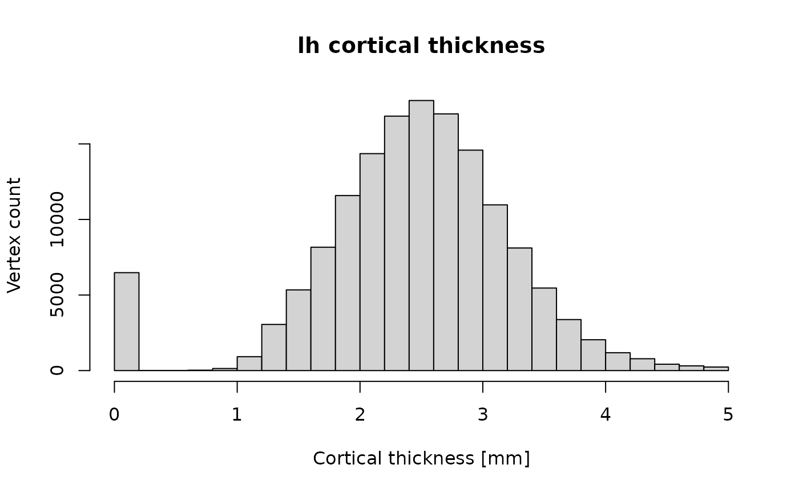
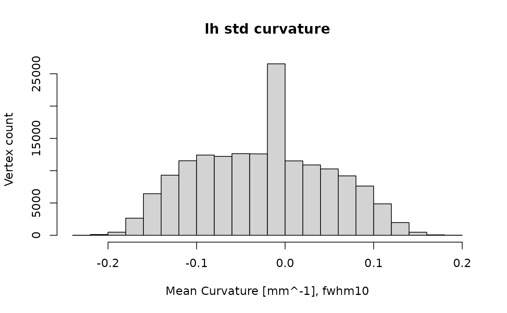

# Reading FreeSurfer neuroimaging data with freesurferformats

In this document, we show how to read brain imaging data from
[FreeSurfer](https://surfer.nmr.mgh.harvard.edu) binary files. These
files are created and used by the [FreeSurfer neuroimaging software
suite](https://surfer.nmr.mgh.harvard.edu) to store volume data and
surface morphometry data computed from MRI brain images.

## Reading FreeSurfer neuroimaging data with freesurferformats

### Background

Brain imaging data come in different formats. Typically, the data is
acquired on a scanner that outputs a set of two-dimensional (2D) DICOM
format images. The 2D images are often combined into a single file that
holds a 3D or 4D stack of images for further processing. Common formats
include ANALYZE, NIFTI, and the MGH format used by FreeSurfer.

This *freesurferdata* R package implements functions to parse data in
MGH format, as well as some related FreeSurfer formats. MGH stands for
Massachusetts General Hospital, and is a binary format. The MGZ format
is a compressed version of the MGH format.

**Note:** To learn how to *write* neuroimaging data with this package,
read the vignette *Writing FreeSurfer neuroimaging data with
freesurferformats* that comes with this package.

### Reading MGH and MGZ format files

Here is a first example for reading MGH data.

``` r

library("freesurferformats")
mgh_file <- system.file("extdata", "brain.mgz", package = "freesurferformats", mustWork = TRUE)
brain <- read.fs.mgh(mgh_file)
cat(sprintf("Read voxel data with dimensions %s. Values: min=%d, mean=%f, max=%d.\n", paste(dim(brain), collapse = "x"), min(brain), mean(brain), max(brain)))
```

    ## Read voxel data with dimensions 256x256x256x1. Values: min=0, mean=7.214277, max=156.

Now, `brain` is an *n*-dimensional matrix, where *n* depends on the data
in the MGZ file. A conformed FreeSurfer volume like `brain.mgz`
typically has 4 dimensions and 256 x 256 x 256 x 1 = 16777216 voxels.
The final dimension, which is 1 here, means it has only a single time
point or *frame*. In this case, the file was compressed and in MGZ
format, but the function does not care, it works for both MGH and MGZ.

If you need the header data, read on.

#### Accessing metadata from the MGH header

To access not only the volume data, but also the header, call
`read.fs.mgh` like this:

``` r

brain_with_hdr <- read.fs.mgh(mgh_file, with_header = TRUE)
brain <- brain_with_hdr$data
# as seen before, this is what we got in the last example (the data).
header <- brain_with_hdr$header
# the header
```

Now you have acces to the following header data:

``` r

header$dtype # int, one of: 0=MRI_UCHAR; 1=MRI_INT; 3=MRI_FLOAT; 4=MRI_SHORT
header$ras_good_flag # int, 0 or 1. Whether the file contains a valid vox2ras matrix and ras_xform (see header$vox2ras_matrix below)
header$has_mr_params # int, 0 or 1. Whether the file contains mr_params (see header$mr_params below)
header$voldim # integer vector or length 4. The volume (=data) dimensions. E.g., c(256, 256, 256, 1) for 3D data.
```

If your MGH/MGZ file contains valid information on the vox2ras matrix
and/or acquisition parameters (`mr_params`), you can access them like
this for the mr params:

``` r

if (header$has_mr_params) {
  mr_params <- header$mr_params
  cat(sprintf("MR acquisition parameters: TR [ms]=%f, filp angle [radians]=%f, TE [ms]=%f, TI [ms]=%f\n", mr_params[1], mr_params[2], mr_params[3], mr_params[4]))
}
```

    ## MR acquisition parameters: TR [ms]=2300.000000, filp angle [radians]=0.157080, TE [ms]=2.010000, TI [ms]=900.000000

And like this for the `vox2ras_matrix`:

``` r

if (header$ras_good_flag) {
  print(header$vox2ras_matrix)
}
```

    ##      [,1] [,2] [,3]      [,4]
    ## [1,]   -1    0    0 127.50005
    ## [2,]    0    0    1 -98.62726
    ## [3,]    0   -1    0  79.09527
    ## [4,]    0    0    0   1.00000

And finally the `ras_xform`:

``` r

if (header$ras_good_flag) {
  print(header$ras_xform)
}
```

    ## NULL

#### A second MGH example

The MGH/MGZ format is also used to store morphometry data mapped to
standard space (fsaverage). In the following example, we read cortical
thickness data in standard space, smoothed with a FWHM 25 kernel:

``` r

mgh_file <- system.file("mystudy", "subject1", "surf", "lh.thickness.fwhm25.fsaverage.mgh")
cortical_thickness_standard <- read.fs.mgh(mgh_file)
```

Now, `cortical_thickness_standard` is a vector of *n* float values,
where *n* is the number of vertices of the *fsaverage* subject’s left
hemisphere surface (i.e., 163842 in FreeSurfer 6).

#### Hint: Further image processing and visualization for volumes

If all you need is to perform statistical analysis of the data in the
MGH file, you are ready to do that after loading. If you need access to
more image operations, I would recommend to convert the data to a NIFTI
object. E.g., if you have
[oro.nifti](https://CRAN.R-project.org/package=oro.nifti) installed, you
could visualize the `brain` data we loaded earlier like this:

``` r

oro.nifti::orthographic(oro.nifti::nifti(brain))
```

If you need advanced visualization, including the option to render
morphometry data or annotation on 3D brain surface meshes, you can have
a look at the [fsbrain package](https://github.com/dfsp-spirit/fsbrain).

### Reading ‘curv’ format files

Let’s read an example morphometry data file that comes with this
package. It contains vertex-wise measures of cortical thickness for the
left hemisphere of a single subject in native space.

``` r

library("freesurferformats")
curvfile <- system.file("extdata", "lh.thickness", package = "freesurferformats", mustWork = TRUE)
ct <- read.fs.curv(curvfile)
```

Now, `ct` is a vector of *n* float values, where *n* is the number of
vertices of the surface mesh the data belongs to (usually
`surf/lh.white`). The number of vertices differs between subjects, as
this is native space data.

We can now have a closer look at the data and maybe plot a histogram of
cortical thickness for this subject:

``` r

cat(sprintf("Read data for %d vertices. Values: min=%f, mean=%f, max=%f.\n", length(ct), min(ct), mean(ct), max(ct)))
```

    ## Read data for 149244 vertices. Values: min=0.000000, mean=2.437466, max=5.000000.

``` r

hist(ct, main = "lh cortical thickness", xlab = "Cortical thickness [mm]", ylab = "Vertex count")
```



### Reading morphometry data, no matter the format

The package provides a wrapper function to read morphometry data, no
matter the format. It always returns data as a vector and automatically
determines the format from the file name. Here we use the function to
read the file from the last example:

``` r

morphfile1 <- system.file("extdata", "lh.thickness", package = "freesurferformats", mustWork = TRUE)
thickness_native <- read.fs.morph(morphfile1)
```

And here is an example for an MGZ file:

``` r

morphfile2 <- system.file("extdata", "lh.curv.fwhm10.fsaverage.mgz", package = "freesurferformats", mustWork = TRUE)
curv_standard <- read.fs.morph(morphfile2)
curv_standard[curv_standard < -1] <- 0
# remove extreme outliers
curv_standard[curv_standard > 1] <- 0
hist(curv_standard, main = "lh std curvature", xlab = "Mean Curvature [mm^-1], fwhm10", ylab = "Vertex count")
```



### Reading morphometry data for a subset of vertices from weight, paint or w files

Sometimes, vertex-wise data is stored in so-called `weight` files, which
are also known as `paint` files or simply as `w` files. They do not
simply contain a list of data values, but pairs of *(vertex index,
value)*. The format is useful when you have data only for a subset of
the vertices of a surface. It seems to be less used these days. Use the
*read.fs.weight* function to read w files.

### Reading annotation files

An annotation file contains a cortical parcellation for a subject, based
on a brain atlas. It contains a label for each vertex of a surface, and
that label assigns this vertex to one of a set of atlas regions. The
file format also contains a colortable, which assigns a color code to
each atlas region. An example file would be `labels/lh.aparc.annot` for
the `aparc` (Desikan) atlas.

Let’s read an example annotation file that comes with this package:

``` r

annotfile <- system.file("extdata", "lh.aparc.annot.gz", package = "freesurferformats", mustWork = TRUE)
annot <- read.fs.annot(annotfile)
```

**Note:** The example file that comes with this package was gzipped to
save space. While this is not typical for annot files, the
*read.fs.annot* function handles it automatically if the filename ends
with *.gz*.

### Working with annotation data

As mentioned earlier, such a file contains various pieces of
information. Let us investigate the labels and the atlas region names
for some vertices first:

``` r

num_vertices_total <- length(annot$vertices)
for (vert_idx in c(1, 5000, 123456)) {
  cat(sprintf("Vertex #%d with zero-based index %d has label code '%d' which stands for atlas region '%s'\n", vert_idx, annot$vertices[vert_idx], annot$label_codes[vert_idx], annot$label_names[vert_idx]))
}
```

    ## Vertex #1 with zero-based index 0 has label code '9182740' which stands for atlas region 'lateraloccipital'
    ## Vertex #5000 with zero-based index 4999 has label code '3957880' which stands for atlas region 'pericalcarine'
    ## Vertex #123456 with zero-based index 123455 has label code '14474380' which stands for atlas region 'superiortemporal'

Now, we will focus on the colortable. We will list the available regions
and their color codes.

``` r

ctable <- annot$colortable$table
regions <- annot$colortable$struct_names
for (region_idx in seq_len(annot$colortable$num_entries)) {
  cat(sprintf("Region #%d called '%s' has RGBA color (%d %d %d %d) and code '%d'.\n", region_idx, regions[region_idx], ctable[region_idx, 1], ctable[region_idx, 2], ctable[region_idx, 3], ctable[region_idx, 4], ctable[region_idx, 5]))
}
```

    ## Region #1 called 'unknown' has RGBA color (25 5 25 0) and code '1639705'.
    ## Region #2 called 'bankssts' has RGBA color (25 100 40 0) and code '2647065'.
    ## Region #3 called 'caudalanteriorcingulate' has RGBA color (125 100 160 0) and code '10511485'.
    ## Region #4 called 'caudalmiddlefrontal' has RGBA color (100 25 0 0) and code '6500'.
    ## Region #5 called 'corpuscallosum' has RGBA color (120 70 50 0) and code '3294840'.
    ## Region #6 called 'cuneus' has RGBA color (220 20 100 0) and code '6558940'.
    ## Region #7 called 'entorhinal' has RGBA color (220 20 10 0) and code '660700'.
    ## Region #8 called 'fusiform' has RGBA color (180 220 140 0) and code '9231540'.
    ## Region #9 called 'inferiorparietal' has RGBA color (220 60 220 0) and code '14433500'.
    ## Region #10 called 'inferiortemporal' has RGBA color (180 40 120 0) and code '7874740'.
    ## Region #11 called 'isthmuscingulate' has RGBA color (140 20 140 0) and code '9180300'.
    ## Region #12 called 'lateraloccipital' has RGBA color (20 30 140 0) and code '9182740'.
    ## Region #13 called 'lateralorbitofrontal' has RGBA color (35 75 50 0) and code '3296035'.
    ## Region #14 called 'lingual' has RGBA color (225 140 140 0) and code '9211105'.
    ## Region #15 called 'medialorbitofrontal' has RGBA color (200 35 75 0) and code '4924360'.
    ## Region #16 called 'middletemporal' has RGBA color (160 100 50 0) and code '3302560'.
    ## Region #17 called 'parahippocampal' has RGBA color (20 220 60 0) and code '3988500'.
    ## Region #18 called 'paracentral' has RGBA color (60 220 60 0) and code '3988540'.
    ## Region #19 called 'parsopercularis' has RGBA color (220 180 140 0) and code '9221340'.
    ## Region #20 called 'parsorbitalis' has RGBA color (20 100 50 0) and code '3302420'.
    ## Region #21 called 'parstriangularis' has RGBA color (220 60 20 0) and code '1326300'.
    ## Region #22 called 'pericalcarine' has RGBA color (120 100 60 0) and code '3957880'.
    ## Region #23 called 'postcentral' has RGBA color (220 20 20 0) and code '1316060'.
    ## Region #24 called 'posteriorcingulate' has RGBA color (220 180 220 0) and code '14464220'.
    ## Region #25 called 'precentral' has RGBA color (60 20 220 0) and code '14423100'.
    ## Region #26 called 'precuneus' has RGBA color (160 140 180 0) and code '11832480'.
    ## Region #27 called 'rostralanteriorcingulate' has RGBA color (80 20 140 0) and code '9180240'.
    ## Region #28 called 'rostralmiddlefrontal' has RGBA color (75 50 125 0) and code '8204875'.
    ## Region #29 called 'superiorfrontal' has RGBA color (20 220 160 0) and code '10542100'.
    ## Region #30 called 'superiorparietal' has RGBA color (20 180 140 0) and code '9221140'.
    ## Region #31 called 'superiortemporal' has RGBA color (140 220 220 0) and code '14474380'.
    ## Region #32 called 'supramarginal' has RGBA color (80 160 20 0) and code '1351760'.
    ## Region #33 called 'frontalpole' has RGBA color (100 0 100 0) and code '6553700'.
    ## Region #34 called 'temporalpole' has RGBA color (70 20 170 0) and code '11146310'.
    ## Region #35 called 'transversetemporal' has RGBA color (150 150 200 0) and code '13145750'.
    ## Region #36 called 'insula' has RGBA color (255 192 32 0) and code '2146559'.

Keep in mind the indices when comparing results to those from other
software: in GNU R, indices start with 1 but the FreeSurfer standard
indices are zero-based:

``` r

r_index <- 50
# one-based index as used by R and Matlab
fs_index <- annot$vertices[r_index]
# zero-based index as used in C, Java, Python and many modern languages
cat(sprintf("Vertex at R index %d has FreeSurfer index %d and lies in region '%s'.\n", r_index, fs_index, annot$label_names[r_index]))
```

    ## Vertex at R index 50 has FreeSurfer index 49 and lies in region 'lateraloccipital'.

Let us retrieve some information on a specific region. We will reuse the
`thickness_native` data loaded above:

``` r

region <- "bankssts"
thickness_in_region <- thickness_native[annot$label_names == region]
cat(sprintf("Region '%s' has %d vertices and a mean cortical thickness of %f mm.\n", region, length(thickness_in_region), mean(thickness_in_region)))
```

    ## Region 'bankssts' has 1722 vertices and a mean cortical thickness of 2.485596 mm.

That’s all the information you can get from an annotation file.

### Reading surface files (meshes)

A surface file contains a brain surface mesh, i.e., a list of vertices
and a list of faces. A vertex is defined by its three x,y,z coordinates,
which are doubles. A face is defined by three vertex indices. Example
files are `surf/lh.white` or `surf/rh.pial`.

Let’s read an tiny example surface file that comes with this package:

``` r

surface_file <- system.file("extdata", "lh.tinysurface", package = "freesurferformats", mustWork = TRUE)
surf <- read.fs.surface(surface_file)
cat(sprintf("Loaded surface consisting of %d vertices and %d faces.\n", nrow(surf$vertices), nrow(surf$faces)))
```

    ## Loaded surface consisting of 5 vertices and 3 faces.

Now we can print the coordinates of vertex 5:

``` r

vertex_index <- 5
v5 <- surf$vertices[vertex_index, ]
cat(sprintf("Vertex %d has coordinates (%f, %f, %f).\n", vertex_index, v5[1], v5[2], v5[3]))
```

    ## Vertex 5 has coordinates (0.300000, 0.300000, 0.300000).

And also the 3 vertices that make up face 2:

``` r

face_index <- 2
f2 <- surf$faces[face_index, ]
cat(sprintf("Face %d consistes of the vertices %d, %d, and %d.\n", face_index, f2[1], f2[2], f2[3]))
```

    ## Face 2 consistes of the vertices 2, 4, and 5.

Note that the vertex indices start with 1 in GNU R. The vertex indices
in the file are 0-based, but this is handled transparently by the
‘read.fs.surface’ and ‘write.fs.surface’ functions.

#### Reading arbitrary triangular meshes and converting to rgl mesh3d

Note that freesurferformats supports not only FreeSurfer meshes, but
also a range of standard mesh file formats. You can use the
[`read.fs.surface()`](https://dfsp-spirit.github.io/freesurferformats/reference/read.fs.surface.md)
function to read meshes in formats like Wavefront Object Format (`obj`),
Stanford Triangle Format (`PLY`), Object File Format (`OFF`), and many
more. Many mesh packages in R use the `mesh3d` datastructure from the
`rgl` package to store or manipulate meshes, so it is useful to know how
to covert our `fs.surface` mesh instance into a `mesh3d` instance. Here
we show how to load a mesh and transform in to a `tmesh3d` instance
(requires the `rgl` package):

``` r

pmesh <- read.fs.surface("~/path/to/mesh.ply")
my_mesh3d <- rgl::tmesh3d(c(t(pmesh$vertices)), c(t(pmesh$faces)), homogeneous = FALSE)
```

One can now use this mesh in `rgl` or other packages like `Rvcg` that
use the mesh3d datastructure. Here we compute the curvature of the mesh
using the `Rvcg` package:

``` r

curv <- Rvcg::vcgCurve(my_mesh3d)
```

### Reading labels

A label defines a list of vertices (of an associated surface or
morphometry file) which are part of it. All others are not. You can
think of it as binary mask. An atlas or annotation can be thought of as
a list of labels, each of which defines a single brain region (the
annotation also contains a colormap for the regions). Labels are useful
to extract or mask out certain brain regions. E.g., you may want to
exclude the medial wall from your analysis, of you may only be
interested in a certain brain region.

The following example reads a label file:

``` r

labelfile <- system.file("extdata", "lh.entorhinal_exvivo.label", package = "freesurferformats", mustWork = TRUE)
label <- read.fs.label(labelfile)
cat(sprintf("The label consists of %d vertices, the first one is vertex %d.\n", length(label), label[1]))
```

    ## The label consists of 1085 vertices, the first one is vertex 88792.

### Reading color lookup tables (LUT files)

A colortable assigns a name and an RGBA color to a set of labels. Such a
colortable is included in an annotation (brain atlas), but there also is
a separate ASCII text file format for these LUTs. An example file in the
format is `FREESURFER_HOME/FreeSurferColorLUT.txt`. To read such a file:

``` r

lutfile <- system.file("extdata", "colorlut.txt", package = "freesurferformats", mustWork = TRUE)
colortable <- read.fs.colortable(lutfile, compute_colorcode = TRUE)
head(colortable)
```

    ##   struct_index                struct_name   r   g   b a     code
    ## 1            0                    Unknown   0   0   0 0        0
    ## 2            1     Left-Cerebral-Exterior  70 130 180 0 11829830
    ## 3            2 Left-Cerebral-White-Matter 245 245 245 0 16119285
    ## 4            3       Left-Cerebral-Cortex 205  62  78 0  5127885
    ## 5            4     Left-Lateral-Ventricle 120  18 134 0  8786552
    ## 6            5          Left-Inf-Lat-Vent 196  58 250 0 16399044

You can also extract such a colortable from an annotation:

``` r

annotfile <- system.file("extdata", "lh.aparc.annot.gz", package = "freesurferformats", mustWork = TRUE)
annot <- read.fs.annot(annotfile)
colortable <- colortable.from.annot(annot)
head(colortable)
```

    ##   struct_index             struct_name   r   g   b a
    ## 1            0                 unknown  25   5  25 0
    ## 2            1                bankssts  25 100  40 0
    ## 3            2 caudalanteriorcingulate 125 100 160 0
    ## 4            3     caudalmiddlefrontal 100  25   0 0
    ## 5            4          corpuscallosum 120  70  50 0
    ## 6            5                  cuneus 220  20 100 0

#### Computing the unique color codes

Some functions in FreeSurfer identify the regions by an internal code
code that is computed from the RGBA values of the colors. These values
are *not* included in the colortable, they need to be computed. You can
pass the optional argument `compute_colorcode=TRUE` to the LUT functions
if you want them to compute the color codes and add the colorcode to the
returned dataframe in a column named ‘code’.

### References

- See [the FreeSurfer
  wiki](https://surfer.nmr.mgh.harvard.edu/fswiki/FsTutorial/MghFormat)
  for details on the MGH format

### Alternatives, similar and related Packages

- The [freesurfer package by John
  Muschelli](https://CRAN.R-project.org/package=freesurfer) implements
  an R wrapper around some FreeSurfer command line utilities. This
  includes functions to read MGH/MGZ files by converting them to NIFTI
  format using command line utilities that come with FreeSurfer, then
  loading the resulting NIFTI file with the [oro.nifti
  package](https://CRAN.R-project.org/package=oro.nifti). As such, the
  package requires that you have FreeSurfer installed.
- Several packages exist that read files in NIFTI format, including
  [oro.nifti](https://CRAN.R-project.org/package=oro.nifti) and
  [RNifti](https://CRAN.R-project.org/package=RNifti).
- My [fsbrain package](https://github.com/dfsp-spirit/fsbrain) provides
  an abstraction layer around fresurferformats. It is desingned to
  quickly access data from single subjects or groups stored in the
  standardized output directory structure used by FreeSurfer and
  recon-all. The package fsbrain also includes advanced visualization
  functions for surface-based data.
- GIFTI files can be read with the [gitfti package by John
  Muschelli](https://cran.r-project.org/package=gifti).
